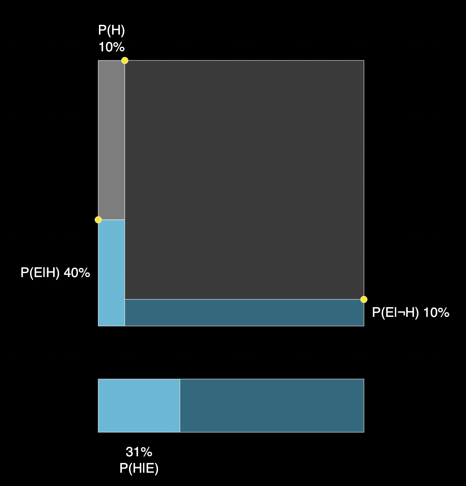

# Bayes theorem
## Fundamentals of the equation

Bayes' theorem is a mathematical formula that describes the probability of an event occurring, based on prior knowledge of conditions that might be related to the event. It is used in statistics and probability theory to calculate the probability of an event occurring, given certain conditions. 

THe formula is the following.

$$P(A|B) = \frac{P(B|A) * P(A)}{P(B)}$$

This can be understood more easily by as following.

$$P(A|B) = \frac{P(B|A) * P(A)}{P(B|A) * P(A) + P(B|A^c) * P(A^c)}$$

Where $A$ is the event we are interested in, and $B$ is the event that has occurred. $A^c$ is the complement of $A$, which is the event that $A$ does not occur.

## Integration of Posterior

$$P(a) = \int_{-\infty}^{\infty} P(a|b)P(b)db$$

We can obtain P(a) by integrating the posterior distribution for all condition b.

### Maximum Likelihood Estimation (MLE) 

$$P(D|w) = \prod_{i=1}^N P(y_i| x_i, w)$$
$$ D = \{(x_1, y_1), (x_2, y_2), ..., (x_N, y_N)\}$$

### Maximum Aposteriori Estimation (MAP)

$$P(w|D) \propto \frac{P(D|w)P(w)}{Z}$$
$$P(y_i|x_i, w) = \mathcal{N}(w^Tx_i, \sigma^2)$$

What is the $P(y | x, w)$? How does it look like?
$$D \rightarrow w \rightarrow y = w^Tx$$

### Instead of calculating w, why don't we calculate $P(y | x, D)$?

$$ P(y | x, D) = \int P(y | x, D, w) dw$$

$w$ depend on $D$, but and $D$ and $y$ depend only on $x, w$. Therefore, we can write the following.

$$P(y | x, D) = \int_w P(y | x, w) P(w | D) dw$$

$\int P(y | x, w)$ is gauss function.

Here, We assume that $P(w)$ is a gaussian distribution. Be carefull that this is a assumption!!
$$P(w | D) = \frac{P(D | w) P(w)}{Z}$$

$$\begin{align*}
P(y | x, D) &= \int_w P(y | x, w) \frac{P(D | w) P(w)}{Z} dw
\end{align*}$$

$\int gaussian * gaussian * gaussian$ is a gaussian function.

This will give the full description about the distribution of probability of $y$ with given $x$ and $D$.

## Understanding the meaning of $P(y | x, D)$
From the fact that $P(y | x, D)$ is a gaussian function, we can understand the following.

$$P(y | x, D) \sim \mathcal{N}(\mu, \Sigma)$$

Which is the same as the following.

$$
P\left(\begin{bmatrix} y_1 \\ y_2 \\ \vdots \\ y_n \\ y \end{bmatrix}, [x_1, x_2, ..., x_n, x] \right) \sim \mathcal{N}(\mu, \Sigma)
$$

The question is, "How can we obtain the covariance matrix $\Sigma$?".

Property of $\Sigma$ is the following.
1. Covariance matrix $\Sigma$ has a positive semi-definite property. This means that the eigenvalues of $\Sigma$ are all positive. Therefore, $\Sigma$ is a kernel function.
2. Similar points need a large value in covariance matrix $\Sigma$.

One possible candidate is Radius Basis Function (RBF) kernel.

$$K(x, x') = \exp \left( -\frac{||x - x'||^2}{2\sigma^2} \right)$$

## Gaussian Process Regression (GPR)

$$P(y | x, D) = P\left(\begin{bmatrix} y_1 \\ y_2 \\ \vdots \\ y_n \\ y \end{bmatrix}, [x_1, x_2, ..., x_n, x] \right) \sim \mathcal{N}(0, \Sigma)$$

$$\Sigma = K, K_{ij} = K(x_i, x_j)$$

$$P(y | x, D) = \mathcal{N}(0, K)$$

This part needs to be reviewed later on.
$$P(y_+ | y_1, ..., y_n, x_+, x_1, ..., x_n, x_+) \sigma \mathcal{N}(K_*^TK^{-1}y, K_{**}K^{-1}K_*)$$

$$\Sigma = \begin{bmatrix} K & K_* \\ K_*^T & K_{**} \end{bmatrix}$$

Now, $K_*^TK^{-1}y$ is the kernel regression and $K_{**}K^{-1}K_*$ is uncertainty.

## Appendix: Ordinary Least Squares (OLS)

OLS is a linear regression model. 

$y_i \in \mathbb{R}$, $x_i \in \mathbb{R}^d$. OLS assumes that the data of $y_i$ is in linear relationship with $x_i$.

Thus we can write the following. ($\epsilon_i$ comes from central limit theorem)
$$y_i = w^Tx_i + \epsilon_i$$
$$\epsilon_i \sim \mathcal{N}(0, \sigma^2)$$

or we can write the following.

$$ y_i = \mathcal{N}(w^Tx_i, \sigma^2)$$

$$P(y_i | x_i, w) = \frac{1}{\sqrt{2\pi\sigma^2}} \exp \left( -\frac{(y_i - w^Tx_i)^2}{2\sigma^2} \right)$$

## Maximum Likelihood Estimation (MLE) approach to solve the OLS
$$ \argmax_w \prod_{i=1}^N P(y_i | x_i, w)$$ 
$$ \argmax_w \sum_{i=1}^N \log P(y_i | x_i, w) = \argmax_w \sum_{i=1}^N \log \left(\frac{1}{\sqrt{2\pi\sigma^2}} \right) - \frac{(y_i - w^Tx_i)^2}{2\sigma^2}$$

$\log\left(\frac{1}{\sqrt{2\pi\sigma^2}} \right)$ and $\frac{1}{2\sigma^2}$ are constants, so we can ignore them when we are maximizing the function.

$$ \argmin_w \frac{1}{n}\sum_{i=1}^N (y_i - w^Tx_i)^2$$

## Maximum Aposteriori Estimation (MAP) approach to solve the OLS

$$P(w | y_1, ..., y_n)$$

If we denote $D = {y_1, ..., y_n}$, and combining the Bayes theorem, we can write the following.

$$P(w | D) \propto \frac{P(D | w) P(w)}{Z}$$

$P(w)$ is the prior distribution of $w$. $P(D | w)$ is the likelihood function. $Z$ is the normalization constant. 
$w$ is a random variable, and we assume that $w$ is a gaussian distribution.

$$ P(w) = \mathcal{N}(0, \tau^2)$$

$$ \begin{align*} 
\argmax_w P(w | D) &= \argmax_w \prod_{i=1}^N P(y_i | x_i, w) P(w) \\
&= \argmax_w \sum_{i=1}^N \log P(y_i | x_i, w) + \log P(w) \\
&= \argmax_w \sum_{i=1}^N \log \left(\frac{1}{\sqrt{2\pi\sigma^2}} \right) - \frac{(y_i - w^Tx_i)^2}{2\sigma^2} + \log \left(\frac{1}{\sqrt{2\pi\tau^2}} \right) - \frac{w^Tw}{2\tau^2} \\
&= \argmin_w \frac{1}{2\sigma^2} \sum_{i=1}^N (y_i - w^Tx_i)^2 + \frac{n}{2\tau^2} w^Tw \\
&= \argmin_w \frac{1}{n}\sum_{i=1}^N (y_i - w^Tx_i)^2 + \lambda ||w||^2_2
\end{align*}$$

where $\lambda = \frac{\sigma^2}{\tau^2}$

### Calculation of $w$
$$ \mathcal{L}(w) = \frac{1}{n} \sum_{i=1}^N (y_i - w^Tx_i)^2 ( + \lambda ||w||^2_2)$$

$X^T = [x_1, x_2, ..., x_n\ ]$, $Y = [y_1, y_2, ..., y_n\ ]$

$$ \begin{align*}
 (Xw - Y)^2 &= (Xw - Y)^T(Xw - Y) \\
    &= w^TX^TXw - 2w^TX^TY + Y^TY \\
 \end{align*}$$

If we take the derivative of $\mathcal{L}(w)$, we can get the following.

$$2X^TXw - 2X^TY = 0$$
$$ w = (X^TX)^{-1}X^TY$$

## Support Vector Machine (SVM)

